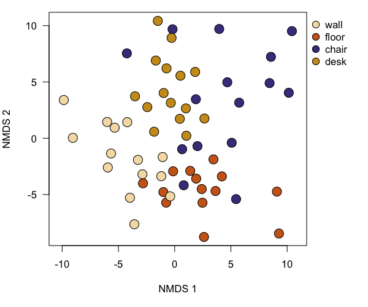

# Bacterial communities on classroom surfaces

## Manuscript demo

_James F Meadow_^1^

^1^ Biology and the Built Environment Center, Institute of Ecology and Evolution, University of Oregon, Eugene, OR USA, jfmeadow@gmail.com

-------------------

### Introduction

The data used here are a small subset (first 20,000 quality-filtered sequences) of those previously published [@meadowSurfaces2014]. This demo illustrates a few basic multivariate analysis methods with a sample dataset. In the original manuscript, we investigated the sources of microbes on classroom surfaces, and whether those microbial communities reflect common human contact with indoor surfaces. 

### Methods

This sequence dataset was processed using QIIME 1.8 [@qiime] with a default MacQIIME installation ([http://www.wernerlab.org/software/macqiime](http://www.wernerlab.org/software/macqiime)). Scripts for processing raw data are in the `../QIIME/` folder. To pick OTUs in that folder, you will execute the `pickTheseOTUs.sh` script sitting in that folder. This script wants to run MacQIIME, so if you are not using MacQIIME, you'll need to alter the top line to reflect your system. 

For statistical analyses, we primiarily used the `phyloseq` package to handle QIIME output files, and `vegan` and `labdsv` for multivariate ecology stats [@phyloseq; @vegan; @labdsv]. All sequences were rarefied to an equal sampling depth (100 sequences per sample) prior to analysis. Beta-diversity was calculated using the Canberra taxonomic metric. The Canberra metric is defined as: $$ d_{jk} = \frac{1}{NZ} \sum \frac{x_{ij}-x_{ik}}{x_{ij}+x_{ik}} $$ where _NZ_ is the number of non-zero entries.  Reproducible documents were created with the `knitr` package in R [@knitr].

### Results

Out of a total 1.5923 &times; 104 sequences that passed quality filtering, we analyzed 5800 sequences in 58 samples distributed among 966 OTUs (97% sequence similarity). The most abundant OTU in the dataset was a Cyanobacterium (2.67% of all sequences). The most abundant taxa are shown in Table 1. \pagebreak

\begin{table}[ht]
\centering
\begin{tabular}{rllllr}
  \hline
 & Phylum & Family & Genus & Species & RelAbu \\ 
  \hline
505954 & Cyanobacteria & Xenococcaceae & - & - & 2.67 \\ 
  1039477 & Firmicutes & Staphylococcaceae & Staphylococcus & epidermidis & 2.52 \\ 
  4449609 & Proteobacteria & Sphingomonadaceae & Sphingomonas & - & 2.40 \\ 
  359689 & Actinobacteria & Corynebacteriaceae & Corynebacterium & - & 2.16 \\ 
  4482309 & Proteobacteria & Acetobacteraceae & - & - & 2.14 \\ 
   \hline
\end{tabular}
\caption{Most abundant taxa across all surfaces.} 
\end{table}

 

\begin{table}[ht]
\centering
\begin{tabular}{lrrrrrr}
  \hline
 & Df & SumsOfSqs & MeanSqs & F.Model & R2 & Pr($>$F) \\ 
  \hline
map\$SurfaceType & 3 & 2.14 & 0.71 & 1.80 & 0.09 & 0.001 \\ 
  Residuals & 54 & 21.39 & 0.40 &  & 0.91 &  \\ 
  Total & 57 & 23.52 &  &  & 1.00 &  \\ 
   \hline
\end{tabular}
\caption{Surface type explains a significant amount of variation among communities.} 
\end{table}

We found that surface type explained a significant amount of community variation (p = 0.001; from PERMANOVA on Canberra distances). 

Next, we tested for a quasi-distance-decay relationship. This is the sort of pattern we see in just about every ecosystem with most forms of life. We even found this to be a stong predictor in the dust sampled from the entire building [@KembelPLOS2014]. So we can use the x and y coordinates as a map of samples, and then calculate the Euclidean pairwise distance between all samples. Then that goes through a mantel test to determine if these distance are correlated with the community distances. 

We did not find any significant coorelation between community similarity and spatial distance (p = 0.456; from Mantel test) when considering all samples together. Likewise, individual sample types tested alone showed no relationship with spatial distance (p > 0.1 for all four sample types). 

### Discussion

So it looks like the type of surface, potentially as a proxy for human contact, explains a significant amount of variation, in the microbial communities on those surfaces, but their proximity to each other around the room doesn't seem to matter at all. 

\clearpage

----------------

### References
