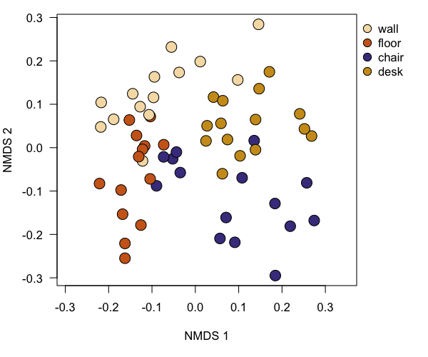

# Reproducible Demo


-----------------

# Bacterial communities on classroom surfaces - Report demo

_James F Meadow_ (`jfmeadow at gmail dot com`)

The data used here are a small subset (first 20,000 quality-filtered sequences) of those used in
Meadow et al. (2014, [Microbiome 2:7](http://www.microbiomejournal.com/content/2/1/7)).


-------------------


## Sequence processing in QIIME

This sequence dataset was processed using QIIME 1.8 with a default MacQIIME installation [http://www.wernerlab.org/software/macqiime](http://www.wernerlab.org/software/macqiime). The script for processing raw data are in `../QIIME/` folder. The script picks OTUs against a closed reference database (Greengenes). To pick OTUs in that folder, you will execute the `pickTheseOTUs.sh` script sitting in that folder. This script wants to run MacQIIME, so if you are not using MacQIIME, you'll probably need to alter that script. Since it is an interactive shell script, you'll want to do this step separately:

```
# pick OTUs using the script in the QIIME folder. 
./pickTheseOTUs.sh
```


## Getting started and importing data to R

To make things reproducible, the first step is to set the random number generator. R's random number generator is not actually random, but designed to look random while still being reproducible. Enter some integer - doesn't really matter what - in the `set.seed` command, and the results should turn out identical each time. 


```r
set.seed(42)
```

Load `biom` and `qiimer` packages to handle QIIME-output files, and `vegan` and `labdsv` for multivariate ecology stats. Also load `xtable` package to convert tables to latex or html. Note that the `knitr` package was loaded at the top. This is used to make simple markdown tables and set options for the HTML document output.


```r
# setwd('~/Dropbox/SLP_Teaching/reportRmd')
library(biom)
library(qiimer)
library(vegan)
library(labdsv)
```


---------------

### Load OTU table

First use the `qiimer` package to gracefully bring big QIIME/JSON-format dataset into R. This saves lots of code and testing, and also avoids having to change the file headers by hand. A few steps are still required to make sure the OTU table, mapping table, and taxonomy table are perfectly lined up. 


```r
rawBiom <- read_biom('../QIIME/otu_table.biom')
surfaceTable.biom <- biom_raw_data(rawBiom)
surfaceTable <- t(matrify(surfaceTable.biom))  # make long form 
```


We'll remove one sample that was run as an unrelated lab control. To remove samples, one way is to call them out directly by name like this. Then look at the table to make sure it looks as expected, with sites as rows, and OTUs as columns. 


```r
surfaceTable <- surfaceTable[!(row.names(surfaceTable) =='Swab.162.61'), ]
kable(surfaceTable[1:5, 1:5])
```

               1000547   1000816   1001908   1002664   1003653
------------  --------  --------  --------  --------  --------
Swab.162.1           0         0         0         0         0
Swab.162.10          0         0         0         0         0
Swab.162.11          0         0         0         0         0
Swab.162.12          0         0         0         0         0
Swab.162.13          0         0         0         0         1


---------------

### Load mapping table

The `qiimer` package nicely deals with QIIME mapping files. So bring this in, set the SampleID column as row names, and then line it all up with the OTU table. 


```r
surfaceMap <- read_qiime_mapping_file('../QIIME/map.txt')
row.names(surfaceMap) <- surfaceMap$SampleID
kable(head(surfaceMap[, c(1,2,3)]))
```

             SampleID     BarcodeSequence   LinkerPrimerSequence 
-----------  -----------  ----------------  ---------------------
Swab.162.1   Swab.162.1   AGCTTACTAATG      TACNVGGGTATCTAATCC   
Swab.162.2   Swab.162.2   AGCTTACTGTTA      TACNVGGGTATCTAATCC   
Swab.162.3   Swab.162.3   AGCTTACATGTA      TACNVGGGTATCTAATCC   
Swab.162.4   Swab.162.4   AGCTTACACATC      TACNVGGGTATCTAATCC   
Swab.162.5   Swab.162.5   AGCTTACCTTAG      TACNVGGGTATCTAATCC   
Swab.162.6   Swab.162.6   AGCTTACGACTA      TACNVGGGTATCTAATCC   


When the samples were being processed initially, zeros were accidentally left out of single digit counts. So a sample named `Swab.162.2` actually gets sorted _after_ `Swab.162.10`. Understandable but unacceptable. So run through and fix the offending names in a separate column that will act as a sorting index. It is probably not a good idea to mess with the actual row names since that could cause problems downstream when dealing with sequencing files or other previous versions of the data. First step is to remove one tiny piece of `phyloseq` baggage. The last command re-sorts the map by this new column and also cuts out some of the columns we won't use. 


```r
surfaceMap$sortID <- as.character(surfaceMap$SampleID)
for(i in 1:nrow(surfaceMap)) {
  if(nchar(surfaceMap$sortID[i]) == 10) {
    surfaceMap$sortID[i] <- gsub('162.', '162.0', surfaceMap$sortID[i])
  }
}
surfaceMap <- surfaceMap[order(surfaceMap$sortID), ]
```


----------------

### Load taxonomic information

Next, extract the taxonomy information from the original OTU biom table. 
The `qiimer` package deals nicely (and very quickly!) with biom format data. However, it returns an unformated list of taxonomic names. So there is some cleanup to make it into a nice data frame. 


```r
surfaceTaxa.list <- biom_taxonomy(rawBiom, attr='taxonomy')
surfaceTaxa <- suppressWarnings(data.frame(do.call('rbind', surfaceTaxa.list)))
names(surfaceTaxa) <- c('Kingdom', 'Phylum', 'Class', 'Order', 'Family', 'Genus', 'Species')

for(i in 1:ncol(surfaceTaxa)) {
  surfaceTaxa[, i] <- gsub('[[:alpha:]]{1}\\_\\_$', '--', surfaceTaxa[, i])
  surfaceTaxa[, i] <- gsub('^[[:alpha:]]{1}\\_\\_', '', surfaceTaxa[, i])
  }

kable(head(surfaceTaxa)[, c(2, 5, 6, 7)])
```

          Phylum           Family               Genus           Species       
--------  ---------------  -------------------  --------------  --------------
838843    Proteobacteria   Acetobacteraceae     --              --            
259732    Proteobacteria   Caulobacteraceae     Brevundimonas   diminuta      
127012    Bacteroidetes    Cytophagaceae        Hymenobacter    --            
185100    Proteobacteria   Bacteriovoracaceae   --              --            
131115    Proteobacteria   Moraxellaceae        Acinetobacter   rhizosphaerae 
4375688   Proteobacteria   Campylobacteraceae   Campylobacter   --            


One last cleanup step to remove mitochondrial and Chloroplast sequences. We can call them out by name and then remove them from both the taxa table. These same OTUs will be removed from the OTU table next. 


```r
dim(surfaceTaxa)
```

```
## [1] 1675    7
```

```r
surfaceTaxa <- surfaceTaxa[-c(grep('mitochondria', 
                                   surfaceTaxa$Family)), ]
surfaceTaxa <- surfaceTaxa[-c(grep('Chloroplast', 
                                   surfaceTaxa$Class)), ]
dim(surfaceTaxa)
```

```
## [1] 1635    7
```


----------------------


### Line up OTU table, mapping table, and taxonomy table

After extracting separate objects, we must line up the rows and columns. Then a few quick tests to make sure everything looks as expected. R does not check to make sure row names match, so you always have to. **This is really important - R always assumes that you already have the rows lined up perfectly. Not doing so will yield false results!** Thus each time the map, OTU table, or taxa table are changed, the rest of the corresponding objects need to be updated. 


```r
surfaceTable <- surfaceTable[, row.names(surfaceTaxa)]
surfaceTable <- surfaceTable[row.names(surfaceMap), ]
```


Then check to make sure that all worked as expected. 


```r
identical(row.names(surfaceTaxa), colnames(surfaceTable))
```

```
## [1] TRUE
```

So all OTUs are present in both the OTU table and the taxonomic info table. And they are in the same order. 


```r
identical(row.names(surfaceMap), row.names(surfaceTable))
```

```
## [1] TRUE
```

So all 3 main objects line up for now. 


------------------------

## Data preparation

### Rarefy to even sampling depth

Add up observations in each sample. For analysis like this, we should rarefy to even sampling depth so some samples are not biased just by having more or fewer observations. 


```r
c(head(sort(rowSums(surfaceTable))), tail(sort(rowSums(surfaceTable))))
```

```
 Swab.162.1  Swab.162.2  Swab.162.7  Swab.162.3  Swab.162.6 Swab.162.26 
         54          80         107         109         120         121 
Swab.162.14 Swab.162.13 Swab.162.52 Swab.162.48 Swab.162.53 Swab.162.16 
        372         397         457         459         469         542 
```

It looks like we can cut them all off at 100 sequences, and not lose many samples to rarefaction. The other nice thing is that the counts in each cell double as percent counts.


```r
rrare <- 100
surfaceTable <- surfaceTable[which(rowSums(surfaceTable) > rrare), ]
tab <- rrarefy(surfaceTable, rrare)

tab <- tab[, which(colSums(tab) > 0)]
taxa <- surfaceTaxa[colnames(tab), ]
dim(taxa)
```

```
## [1] 964   7
```

```r
map <- surfaceMap[row.names(tab), ]
```


```r
kable(data.frame(head(taxa)[, c(2, 5:7)]))
```

         Phylum           Family               Genus              Species  
-------  ---------------  -------------------  -----------------  ---------
838843   Proteobacteria   Acetobacteraceae     --                 --       
259732   Proteobacteria   Caulobacteraceae     Brevundimonas      diminuta 
127012   Bacteroidetes    Cytophagaceae        Hymenobacter       --       
829373   Actinobacteria   Pseudonocardiaceae   Pseudonocardia     --       
253429   Bacteroidetes    [Weeksellaceae]      Chryseobacterium   --       
355102   Firmicutes       Lachnospiraceae      --                 --       


------------

### Add plotting magic to the mapping table

Since the OTU table is sorted out for now, the map, or metadata table, can be sorted by the row names of the OTU table. Then colors get added by name for easy plotting later. 


```r
map$color <- 'wheat'
map$color[map$SurfaceType == 'floor'] <- 'chocolate3'
map$color[map$SurfaceType == 'chair'] <- 'darkslateblue'
map$color[map$SurfaceType == 'desk'] <- 'goldenrod3'
map$SurfaceType <- factor(map$SurfaceType, 
                          levels=c("wall", "floor", 
                                   "chair", "desk"))
```


Since the map is final, one last step to reconcile the OTU table to the new mapping table row order. The same command also strips out OTUs that didn't make the rarefaction cut. Then reconcile the taxonomy table to the new trimmed OTU table, and everything is ready for analysis. 

---------------

## Analysis

### Calculate pairwise similarity/dissimilarity

To compare communities, make a matrix of pairwise multivariate distances (thus calculating beta-diversity). There are dozens of choices. The Canberra metric tends to work really well when communities share their most abundant OTUs, but have the strongest differences in a subset of relatively rare OTUs. Since we expect that to be the case in this dataset, the Canberra metric will be used here. Legendre & Legendre's _Numerical Ecology_ is a terrific reference for choosing beta-diversity metrics that are appropriate for each problem. 


```r
distCanberra <- vegdist(tab, 'canberra')
```


---------------

### Create ordination


That distance matrix can go directly into many different multivariate analysis functions. To visualize the potential differences among sample types (walls, desks, floors and chairs), non-metric multidimensional scaling (NMDS) tends to be a mathematically satisfying visualization solution. There are several different ways to create an NMDS in R. This function is in the `labdsv` package, and uses random starting positions for all points before trying to fit the most parsimonious dissimilarity solution. Since we used `set.seed` at the top, it is not entirely random, but useful nonetheless. 


```r
nmdsCanberra <- nmds(distCanberra)
```

The plot will give us an indication of whether we should use discriminant analysis to test for differences among sample types. 


```r
par(mar=c(5,4,1,5), las=1, xpd=TRUE)
plot(nmdsCanberra, pch=21, cex=2, bg=map$color)
legend(par()$usr[2], par()$usr[4], pch=21, pt.cex=1.5,
       legend=levels(map$SurfaceType), 
       pt.bg=unique(map$color), bty='n')
```

 

There is an apparent clustering by sample type (color in this case), so we should test to see if it is statistically worth discussing. 


---------------

### Discriminant analysis


The `adonis` function performs permutational multivariate analysis of variance (PERMANOVA), using 999 iterations as a default. The iterative nature is a must since our pairwise sample distances are technically not independent. Thus each iteration picks a few of them and test for a difference. Since we are only running 999 iterations, we can't reasonably report p-values lower than 0.001, since that is 1/1000. 


```r
surfaceTypeModel <- adonis(distCanberra ~ map$SurfaceType)$aov.tab
kable(surfaceTypeModel)
```

                   Df   SumsOfSqs     MeanSqs    F.Model          R2   Pr(>F)
----------------  ---  ----------  ----------  ---------  ----------  -------
map$SurfaceType     3    2.196251   0.7320836   1.848144   0.0931142    0.001
Residuals          54   21.390385   0.3961182         NA   0.9068858       NA
Total              57   23.586635          NA         NA   1.0000000       NA

Yes - quite significant. So there is one reasonably strong result, but the R^2 value is pretty weak. That tells us that sample type certainly matters, but there is still lots of variability that cannot be explained just by that single factor. 


----------

### Distance-decay Mantel test


So we should check for a quasi-distance-decay relationship. This is the sort of pattern we see in just about every ecosystem with most forms of life. We even found this to be a stong predictor in the dust sampled from the [entire building](http://www.plosone.org/article/info%3Adoi%2F10.1371%2Fjournal.pone.0087093). So we can use the x and y coordinates as a map of samples, and then calculate the Euclidean pairwise distance between all samples. Then that goes through a mantel test to determine if these distance are correlated with the community distances. There is not a convenient table output for the `mantel` function, so it goes to standard output. 


```r
distSpatial <- dist(data.frame(map$xcoor, map$ycoor))
mantel(distCanberra, distSpatial)
```

```

Mantel statistic based on Pearson's product-moment correlation 

Call:
mantel(xdis = distCanberra, ydis = distSpatial) 

Mantel statistic r: -0.02042 
      Significance: 0.655 

Upper quantiles of permutations (null model):
   90%    95%  97.5%    99% 
0.0556 0.0708 0.0886 0.1089 

Based on 999 permutations
```

No - not even close. So proximity to other samples doesn't matter. But we are testing this with all sample types together. Is it still unimportant if each sample type is considered independently?


```r
chair <- which(map$SurfaceType == 'chair')
wall <- which(map$SurfaceType == 'wall')
desk <- which(map$SurfaceType == 'desk')
floor <- which(map$SurfaceType == 'floor')

testMantel <- function(these) {
  mantel(vegdist(tab[these, ], 'canberra'), 
                 dist(data.frame(map$xcoor, map$ycoor)[these, ]))
  }

testMantel(chair)$signif
```

```
[1] 0.257
```

```r
testMantel(wall)$signif
```

```
[1] 0.979
```

```r
testMantel(desk)$signif
```

```
[1] 0.936
```

```r
testMantel(floor)$signif
```

```
[1] 0.496
```


No. Not for any of the four surfaces. 

So it looks like the type of surface, potentially as a proxy for human contact, explains a significant amount of variation, in the microbial communities on those surfaces, but their proximity to each other around the room doesn't matter at all. 


-----------

### Most abundant OTUs


Here is a table of the most abundant taxa we found in the study: 


```r
mostAbu <- names(sort(colSums(tab), TRUE)[1])
```


```r
tops <- names(sort(colSums(tab), decreasing=TRUE)[1:5])
topTaxa <- taxa[tops, c(2, 5:7)]
topTaxa$RelAbu <- colSums(tab)[tops]/sum(tab)*100
kable(topTaxa)  
```

          Phylum           Family                Genus              Species          RelAbu
--------  ---------------  --------------------  -----------------  ------------  ---------
505954    Cyanobacteria    Xenococcaceae         --                 --             3.137931
4449609   Proteobacteria   Sphingomonadaceae     Sphingomonas       --             2.327586
1039477   Firmicutes       Staphylococcaceae     Staphylococcus     epidermidis    2.155172
359689    Actinobacteria   Corynebacteriaceae    Corynebacterium    --             2.017241
134470    Firmicutes       Alicyclobacillaceae   Alicyclobacillus   --             1.965517


