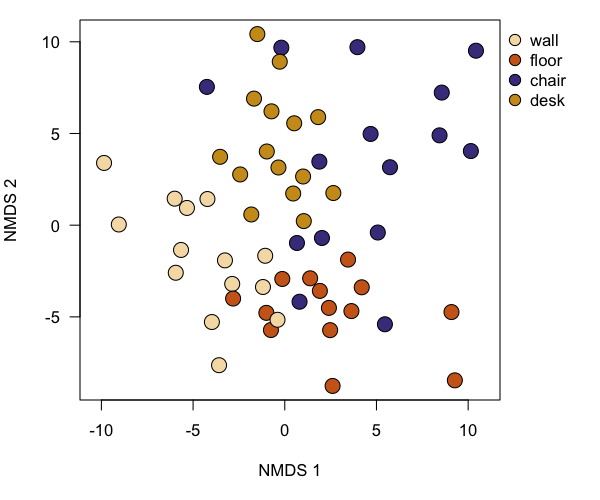

# Bacterial communities on classroom surfaces

## Report demo

_James F Meadow_ (`jfmeadow at gmail dot com`)

The data used here are a small subset (first 20,000 quality-filtered sequences) of those used in
Meadow et al. (2014, [Microbiome 2:7](http://www.microbiomejournal.com/content/2/1/7)).

### Sequence processing

This sequence dataset was processed using QIIME 1.8 with a default MacQIIME installation [http://www.wernerlab.org/software/macqiime](http://www.wernerlab.org/software/macqiime). The script for processing raw data are in `../QIIME/` folder. The script picks OTUs against a closed reference database (Greengenes). To pick OTUs in that folder, you will execute the `pickTheseOTUs.sh` script sitting in that folder. This script wants to run MacQIIME, so if you are not using MacQIIME, you'll probably need to alter the top line. Since this is an interactive shell script, you'll want to do this step separately:

```
# pick OTUs using the script in the QIIME folder. 
./pickTheseOTUs
```


### Getting started and importing data to R

To make things reproducible, the first step is to set the random number generator. R's random number generator is not actually random, but designed to look random while still being reproducible. Enter some integer - doesn't really matter what - in the `set.seed` command, and the results should turn out identical each time. 


```r
set.seed(42)
```


Load `phyloseq` to handle QIIME output files, and `vegan` and `labdsv` for multivariate ecology stats. Also load `xtable` package to convert tables to latex or html. 


```r
# setwd('~/Dropbox/SLP_Teaching/reportRmd')
require(knitr)
require(phyloseq)
require(vegan)
require(labdsv)
require(xtable)
```


First use the `phyloseq` package to gracefully bring big QIIME/JSON-format dataset into R. This saves lots of code and testing, and also avoids having to change the file headers by hand. 


```r
surfaceTablePhyloseq <- import_biom('../QIIME/otu_table.biom', 
                          parseFunction=parse_taxonomy_greengenes)
surfaceMapPhyloseq <- import_qiime_sample_data('../QIIME/map.txt')
```


Once `phyloseq` has done the heavy lifting to input data, we can extract the parts we want. First is the OTU table. One sample gets excluded here since it was an internal control that is not used in this script. Then print out a bit to make sure it looks as expected. 


```r
surfaceTable.tmp <- t(otu_table(surfaceTablePhyloseq))
surfaceTable.tmp <- 
  surfaceTable.tmp[!(row.names(surfaceTable.tmp) =='Swab.162.61'), ]
surfaceTable <- as(surfaceTable.tmp, 'matrix')
kable(surfaceTable[1:5, 1:5])
```

|id           |  838843|  259732|  127012|  185100|  131115|
|:------------|-------:|-------:|-------:|-------:|-------:|
|Swab.162.9   |       1|       0|       0|       0|       0|
|Swab.162.58  |       1|       0|       0|       0|       0|
|Swab.162.5   |       1|       0|       0|       0|       0|
|Swab.162.16  |       0|       1|       0|       0|       0|
|Swab.162.20  |       0|       1|       0|       0|       0|


Extract the mapping file. This was in QIIME format, so the comment line needs to be removed to take out out of its `phyloseq` object. The output table is just the first three columns to make sure that the table looks ok. 


```r
surfaceMap <- data.frame(surfaceMapPhyloseq)[-1, ]
kable(head(surfaceMap[, c(1,2,3)]))
```

|id          |X.SampleID  |BarcodeSequence  |LinkerPrimerSequence  |
|:-----------|:-----------|:----------------|:---------------------|
|Swab.162.1  |Swab.162.1  |AGCTTACTAATG     |TACNVGGGTATCTAATCC    |
|Swab.162.2  |Swab.162.2  |AGCTTACTGTTA     |TACNVGGGTATCTAATCC    |
|Swab.162.3  |Swab.162.3  |AGCTTACATGTA     |TACNVGGGTATCTAATCC    |
|Swab.162.4  |Swab.162.4  |AGCTTACACATC     |TACNVGGGTATCTAATCC    |
|Swab.162.5  |Swab.162.5  |AGCTTACCTTAG     |TACNVGGGTATCTAATCC    |
|Swab.162.6  |Swab.162.6  |AGCTTACGACTA     |TACNVGGGTATCTAATCC    |


The taxonomic assignments are embedded in the OTU table. The output is a really convenient table with OTU numeric IDs as row names. There is one `for` loop to remove the factor baggage so that we can replace all NA's. The output table is shortened to see just a few taxonomic levels. 


```r
surfaceTaxa <- data.frame(tax_table(surfaceTablePhyloseq))
for (i in 1:ncol(surfaceTaxa)) {
  surfaceTaxa[, i] <- as.character(surfaceTaxa[, i])
  surfaceTaxa[, i][is.na(surfaceTaxa[, i])] <- '-'
  }
kable(data.frame(head(surfaceTaxa)[, c(2, 5:7)]))
```

|id       |Phylum          |Family              |Genus          |Species        |
|:--------|:---------------|:-------------------|:--------------|:--------------|
|838843   |Proteobacteria  |Acetobacteraceae    |-              |-              |
|259732   |Proteobacteria  |Caulobacteraceae    |Brevundimonas  |diminuta       |
|127012   |Bacteroidetes   |Cytophagaceae       |Hymenobacter   |-              |
|185100   |Proteobacteria  |Bacteriovoracaceae  |-              |-              |
|131115   |Proteobacteria  |Moraxellaceae       |Acinetobacter  |rhizosphaerae  |
|4375688  |Proteobacteria  |Campylobacteraceae  |Campylobacter  |-              |


### Check to make sure things line up

After extracting separate objects, a few quick tests to make sure everything looks as expected. R does not check to make sure row names match, so you always have to. 


```r
identical(row.names(surfaceTaxa), colnames(surfaceTable))
```

```
## [1] TRUE
```


So all OTUs are present in both the OTU table and the taxonomic info table. And they are in the same order. 


```r
identical(sort(row.names(surfaceMap)), sort(row.names(surfaceTable)))
```

```
## [1] TRUE
```


All of the row names in the mapping file also match with the row names of the OTU table. So all of the samples are there, but they are not in the same order - notice the `sort` commands used above. 


```r
dim(surfaceTaxa)
surfaceTaxa <- surfaceTaxa[-c(grep('mitochondria', 
                                   surfaceTaxa$Family)), ]
surfaceTaxa <- surfaceTaxa[-c(grep('Chloroplast', 
                                   surfaceTaxa$Class)), ]
surfaceTable <- surfaceTable[, row.names(surfaceTaxa)]
identical(row.names(surfaceTaxa), colnames(surfaceTable))
dim(surfaceTaxa)
```


### Rarefy to even sampling depth

Add up observations in each sample. For analysis like this, we should rarefy to even sampling depth so some samples are not biased just by having more or fewer observations. 


```r
sort(rowSums(surfaceTable), decreasing=FALSE)
```

```
##  Swab.162.7 Swab.162.26  Swab.162.6  Swab.162.1  Swab.162.2 Swab.162.27 
##         115         129         135         145         151         163 
## Swab.162.31  Swab.162.3  Swab.162.5 Swab.162.22  Swab.162.8 Swab.162.25 
##         163         164         184         187         190         201 
##  Swab.162.4 Swab.162.35 Swab.162.30 Swab.162.29 Swab.162.38 Swab.162.23 
##         206         214         217         219         221         223 
## Swab.162.19 Swab.162.32 Swab.162.51 Swab.162.42 Swab.162.36 Swab.162.34 
##         233         248         249         279         280         283 
## Swab.162.28 Swab.162.10 Swab.162.41 Swab.162.17 Swab.162.18 Swab.162.58 
##         283         297         298         304         304         308 
## Swab.162.40 Swab.162.21 Swab.162.33 Swab.162.57 Swab.162.59 Swab.162.45 
##         312         315         321         322         324         325 
## Swab.162.44  Swab.162.9 Swab.162.43 Swab.162.37 Swab.162.12 Swab.162.46 
##         329         332         332         337         354         355 
## Swab.162.20 Swab.162.49 Swab.162.24 Swab.162.39 Swab.162.14 Swab.162.15 
##         356         358         366         371         378         378 
## Swab.162.50 Swab.162.56 Swab.162.55 Swab.162.47 Swab.162.13 Swab.162.54 
##         388         390         396         398         420         421 
## Swab.162.60 Swab.162.11 Swab.162.48 Swab.162.52 Swab.162.53 Swab.162.16 
##         437         455         482         495         511         552
```


It looks like we can cut them all off at 100 sequences, and not lose any samples to rarefaction. The other nice thing is that the counts in each cell double as percent counts.


```r
surfaceTable <- surfaceTable[which(rowSums(surfaceTable) > 100), ]
tab <- rrarefy(surfaceTable, 100)
```


### Fix a few things in the mapping table, and sort by sample name

Since the OTU table is sorted out for now, the map, or metadata table, can be sorted by the row names of the OTU table. Then colors get added by name for easy plotting later. 


```r
map <- surfaceMap[row.names(tab), ]
map$color <- 'wheat'
map$color[map$SurfaceType == 'floor'] <- 'chocolate3'
map$color[map$SurfaceType == 'chair'] <- 'darkslateblue'
map$color[map$SurfaceType == 'desk'] <- 'goldenrod3'
map$SurfaceType <- factor(map$SurfaceType, 
                          levels=c("wall", "floor", 
                                   "chair", "desk"))
```


When the samples were being processed initially, zeros were accidentally left out of single digit counts. So a sample named `Swab.162.2` actually gets sorted _after_ `Swab.162.10`. Understandable but unacceptable. So run through and fix the offending names in a separate column that will act as a sorting index. It is probably not a good idea to mess with the actual row names since that could cause problems downstream when dealing with sequencing files or other previous versions of the data. First step is to remove one tiny piece of `phyloseq` baggage. The last command resorts the map by this new column and also cuts out some of the columns we won't use. 


```r
names(map)[1] <- gsub('X.', '', names(map)[1])

map$sortID <- as.character(map$SampleID)
for(i in 1:nrow(map)) {
  if(nchar(map$sortID[i]) == 10) {
    map$sortID[i] <- gsub('162.', '162.0', map$sortID[i])
  }
}

map <- map[order(map$sortID), 
           c('sortID', 'SurfaceType', 'xcoord', 'ycoord', 'color')]
```


Since the map is final, one last step to reconcile the OTU table to the new mapping table row order. The same command also strips out OTUs that didn't make the rarefaction cut. Then reconcile the taxonomy table to the new trimmed OTU table, and everything is ready for analysis. 


```r
tab <- tab[row.names(map), which(colSums(tab) > 0)]
taxa <- surfaceTaxa[colnames(tab), ]
dim(taxa)
```

```
## [1] 916   7
```


```r
kable(data.frame(head(taxa)[, c(2, 5:7)]))
```

|id       |Phylum          |Family              |Genus           |Species   |
|:--------|:---------------|:-------------------|:---------------|:---------|
|838843   |Proteobacteria  |Acetobacteraceae    |-               |-         |
|259732   |Proteobacteria  |Caulobacteraceae    |Brevundimonas   |diminuta  |
|127012   |Bacteroidetes   |Cytophagaceae       |Hymenobacter    |-         |
|4375688  |Proteobacteria  |Campylobacteraceae  |Campylobacter   |-         |
|4444760  |Actinobacteria  |Micrococcaceae      |-               |-         |
|829373   |Actinobacteria  |Pseudonocardiaceae  |Pseudonocardia  |-         |

### Analysis

To compare communities, make a matrix of pairwise multivariate distances (thus calculating beta-diversity). There are dozens of choices. The Canberra metric tends to work really well when communities share their most abundant OTUs, but have the strongest differences in a subset of relatively rare OTUs. Since we expect that to be the case in this dataset, the Canberra metric will be used here. Legendre & Legendre's _Numerical Ecology_ is a terrific reference for choosing beta-diversity metrics that are appropriate for each problem. 


```r
distCanberra <- vegdist(tab, 'canberra')
```


That distance matrix can go directly into many different multivariate analysis functions. To visualize the potential differences among sample types (walls, desks, floors and chairs), non-metric multidimensional scaling (NMDS) tends to be a mathematically satisfying visualization solution. There are several different ways to create an NMDS in R. This function is in the `labdsv` package, and uses random starting positions for all points before trying to fit the most parsimonious dissimilarity solution. Since we used `set.seed` at the top, it is not entirely random, but useful nonetheless. 


```r
nmdsCanberra <- bestnmds(distCanberra)
```


The plot will give us an indication of whether we should use discriminant analysis to test for differences among sample types. 


```r
par(mar=c(5,4,1,5), las=1, xpd=TRUE)
plot(nmdsCanberra, pch=21, cex=2, bg=map$color)
legend(par()$usr[2], par()$usr[4], pch=21, pt.cex=1.5,
       legend=levels(map$SurfaceType), 
       pt.bg=unique(map$color), bty='n')
```

 


There is an apparent clustering by sample type (color in this case), so we should test to see if it is statistically worth discussing. The `adonis` function performs permutational multivariate analysis of variance (PERMANOVA), using 999 iterations as a default. The iterative nature is a must since our pairwise sample distances are technically not independent. Thus each iteration picks a few of them and test for a difference. Since we are only running 999 iterations, we can't reasonably report p-values lower than 0.001, since that is 1/1000. 


```r
surfaceTypeModel <- adonis(distCanberra ~ map$SurfaceType)$aov.tab
kable(surfaceTypeModel)
```

|id               |  Df|  SumsOfSqs|  MeanSqs|  F.Model|      R2|  Pr(>F)|
|:----------------|---:|----------:|--------:|--------:|-------:|-------:|
|map$SurfaceType  |   3|      2.124|   0.7080|    1.766|  0.0864|   0.001|
|Residuals        |  56|     22.445|   0.4008|       NA|  0.9136|      NA|
|Total            |  59|     24.569|       NA|       NA|  1.0000|      NA|


Yes - quite significant. So there is one reasonably strong result, but the R^2 value is pretty weak. That tells us that sample type certainly matters, but there is still lots of variability that cannot be explained just by that factor. 

So we should check for a quasi-distance-decay relationship. This is the sort of pattern we see in just about every ecosystem with most forms of life. We even found this to be a stong predictor in the dust sampled from the [entire building](http://www.plosone.org/article/info%3Adoi%2F10.1371%2Fjournal.pone.0087093). So we can use the x and y coordinates as a map of samples, and then calculate the Euclidean pairwise distance between all samples. Then that goes through a mantel test to determine if these distance are correlated with the community distances. There is not a convenient table output for the `mantel` function, so it goes to standard output. 


```r
distSpatial <- dist(data.frame(map$xcoor, map$ycoor))
mantel(distCanberra, distSpatial)
```

```
## 
## Mantel statistic based on Pearson's product-moment correlation 
## 
## Call:
## mantel(xdis = distCanberra, ydis = distSpatial) 
## 
## Mantel statistic r: -0.0401 
##       Significance: 0.83 
## 
## Upper quantiles of permutations (null model):
##    90%    95%  97.5%    99% 
## 0.0620 0.0765 0.0905 0.1051 
## 
## Based on 999 permutations
```


No - not even close. So proximity to other samples doesn't matter. But we are testing this with all sample types together. Is it still unimportant if each sample type is considered independently?


```r
chair <- which(map$SurfaceType == 'chair')
wall <- which(map$SurfaceType == 'wall')
desk <- which(map$SurfaceType == 'desk')
floor <- which(map$SurfaceType == 'floor')

testMantel <- function(these) {
  mantel(vegdist(tab[these, ], 'canberra'), 
                 dist(data.frame(map$xcoor, map$ycoor)[these, ]))
  }

testMantel(chair)$signif
```

```
## [1] 0.326
```

```r
testMantel(wall)$signif
```

```
## [1] 0.63
```

```r
testMantel(desk)$signif
```

```
## [1] 0.193
```

```r
testMantel(floor)$signif
```

```
## [1] 0.806
```


No. Not for any of the four surfaces. 

So it looks like the type of surface, potentially as a proxy for human contact, explains a significant amount of variation, in the microbial communities on those surfaces, but their proximity to each other around the room doesn't matter at all. 


Here is a table of the most abundant taxa we found in the study: 


```r
mostAbu <- names(sort(colSums(tab), TRUE)[1])
```


```r
tops <- names(sort(colSums(tab), decreasing=TRUE)[1:5])
topTaxa <- taxa[tops, c(2, 5:7)]
topTaxa$RelAbu <- colSums(tab)[tops]/sum(tab)*100
kable(topTaxa)  # quick way to make markdown tables that will convert to LaTeX
```

|id       |Phylum          |Family              |Genus            |Species  |  RelAbu|
|:--------|:---------------|:-------------------|:----------------|:--------|-------:|
|4386317  |Cyanobacteria   |-                   |-                |-        |   2.783|
|1132020  |Cyanobacteria   |-                   |-                |-        |   2.550|
|4410245  |Proteobacteria  |mitochondria        |-                |-        |   2.483|
|505954   |Cyanobacteria   |Xenococcaceae       |-                |-        |   2.450|
|359689   |Actinobacteria  |Corynebacteriaceae  |Corynebacterium  |-        |   2.183|


